# 本科生毕业设计

# 题目： 大棚内西瓜花自动授粉系统设计

机械工程 学 院 机械工程 专 业

学 号 1044220225

学生姓名 刘程元

指导教师 纪小刚 教授

化春键 副教授

二〇二六年五月

# 设计总说明

关键词：

# ABSTRACT

Keywords:

# 目 录

设计总说明..

ABSTRACT. I

目 录 ..

第1 章 绪论.. 4

1.1 课题意义. 4

1.1.1 课题背景 ... 4

1.1.2 西瓜授粉技术的发展历程 . 5

1.2 课题研究设计内容. 5

1.3 课题技术要求. 6

1.3.1 国内外发展现状 . 6

1.3.2 课题指导思想 8

1.3.3 课题拟解决问题 8

第2 章 总体方案设计. 9

2.1 移动平台方案比较. 9

2.2 末端执行器方案比较.. 11

2.3 机械臂方案比较. 13

2.3.1 机械臂驱动方式比较 . 13

2.3.2 机械臂构型方案 15

本章小结. 16

第3 章 自动授粉系统各组成部分的结构设计. 17

3.1 西瓜大棚尺寸选型. 17

3.2 轨道设计. 17

3.2.1 轨道设计 .. 17

3.2.2 轨道校核计算 . 18

# 江南大学学士学位论文

3.3 移动平台结构设计. .20

3.3.1 移动平台结构设计.. 20

3.3.2 移动平台参数计算.. 23

3.4 机械臂设计. .25

3.4.1 机械臂结构设计.. 25

3.4.2 机械臂作业范围核算.. 26

3.5 末端执行器设计 27

3.5.1 末端执行器设计.. 27

3.5.2 末端执行器计算校核.. 28

3.6 大棚内西瓜花自动授粉系统总体三维建模. . 29

本章小结. .. 30

第4 章 结构可行性仿真验证. . 32

4.1 自动授粉系统运动仿真. . 32

4.2 自动授粉系统有限元仿真（轨道抗弯 $^ +$ 静止时摩擦力是否足够）...32

本章小结. . 32

第5 章 控制系统设计与验证. . 33

5.1 授粉控制系统设计. .33

5.1 授粉控制系统电路设计 . 34

5.2 全局移动子系统电路仿真（PROTEUS $+$ 单片机 C 语言） .............. ... 35

5.3 视觉伺服子系统运动仿真（ROS 或 MOVEIT） . .. 37

本章小结. . 37

第7 章 结论与展望. .38

7.1 结论 .. . 38

7.2 不足之处及未来展望 . 38

参考文献(从第二章开始).. . 39

致谢.. .41

目录

# 第 1 章 绪论

西瓜作为全球重要的经济作物，在我国农业生产中占据举足轻重的地位。根据统计数据显示，2024年我国西瓜收获面积已达2188万亩，年产量高达6364万吨，稳居世界第一。随着人民生活水平的提高，市场对高品质西瓜的需求日益增大。然而，在西瓜庞大的产业链中，授粉环节是决定坐果率、果实品质（如畸形率、甜度、含水量）的关键工序，同时也是耗费人力物力最为显著的环节。西瓜花属于虫媒花，而现代设施农业大棚种植多集中于冬春季节，寒冷的气候导致自然界昆虫活动受阻，且密闭的大棚环境限制了自然风和外界昆虫的进入，导致自然授粉效果极差。因此，目前产业界普遍采用人工辅助授粉或喷洒生长调节剂（激素）的方式来保障坐果率。

然而，随着我国人口老龄化加剧和农村适龄劳动力的流出，劳动力成本急剧上升，“用工荒”问题在农忙时节尤为突出。传统的人工授粉方式不仅劳动强度大、效率低，而且极易受光照、温湿度等环境因素制约，难以满足未来设施西瓜规模化、集约化种植的发展趋势。此外，激素授粉虽然操作简便，但可能影响果实口感及食品安全。为了解决上述痛点，开发高效、精准的自动西瓜花授粉技术成为设施农业规模化发展的迫切需求。近年来，农业机器人技术为解决上述问题提供了新思路。尽管国内外学者在果蔬采摘机器人领域取得一定进展，但授粉作业因涉及复杂的环境感知和动态操作，相关研究仍处于探索阶段。

针对上述挑战，本研究提出一种基于空轨移动平台与视觉伺服机械臂的大棚内西瓜花自动授粉系统。该系统采用大棚顶部空轨与摩擦轮驱动移动平台相结合的方式实现全局移动，利用倒吊式六自由度机械臂配合机器视觉技术实现局部精确定位与授粉作业。下文将围绕系统设计、关键技术实现展开详细论述。

# 1.1 课题意义

# 1.1.1 课题背景

在西瓜庞大的产业链中，授粉环节至关重要，其对西瓜的坐果率、畸形率、生长质量、甜度和含水量等方面均有较大影响，且在此环节耗费人力物力最为显著。西瓜花是虫媒花，由于大棚种植时间多集中于冬季，寒冷的气候导致昆虫活动受阻，进而影响授粉工作。因此，一般采用人工辅助坐果来保障西瓜的坐果率，常见的人工辅助坐果方式有人工授粉和喷洒生长调节剂。然而，随着农村适龄劳动力的流出、劳动力价格的上涨，传统的辅助坐果技术因对劳动力的过度依赖，已不能满足未来设施西瓜规模化、集约化种植的发展趋势。

花期内授粉效果的好坏直接影响到花粉萌发和受精坐果。由于西瓜开花时间短，自然授粉（自然风、昆虫等）在密闭的设施环境内比较受制约，授粉效果也极易受光照条件、温湿度、风速等因素的影响。不仅如此，花粉采集成本高，故而如何高效精量授粉是目前被广泛关注的问题。为提高授粉效率，对传统田间机器人进行基于机器视觉技术的创新改造，跟上时代发展的步伐十分必要。借助机器视觉系统提供的田间待授粉西瓜花的位置坐标信息，使授粉机器人具有自动规划授粉路径和自动对待授粉花体授粉的功能，可使操作者远离复杂的现场环境，提高工作的效率，降低劳动强度，具有一定的现实意义。

批注 [a1]: 已根据联合国粮食及农业组织统计数据

https://www.fao.org/faostat/zh/#data/QCL 进行更改

批注 [昊孙2]: 段与段之前不需要空0.5行，注意全文修改

批注 [a3R2]: 已修改

# 1.1.2 西瓜授粉技术的发展历程

西瓜授粉技术的发展经历了从自然授粉到人工辅助授粉，再到机械化、智能化授粉的演进过程。早期西瓜种植主要依赖自然风和昆虫进行授粉，但在设施大棚环境下，由于空间密闭和气候条件限制，自然授粉效果难以保证。目前，人工授粉在西瓜种植中仍占主导地位，这种方式虽然能够保证授粉质量，但劳动力成本高、效率低，难以满足大规模生产的需求。此外，人工授粉很难把握用量，从而对西瓜的生长发育造成影响。

相较于人工授粉，蜜蜂辅助授粉能够更有效地实现设施作物的授粉，从而进一步提高设施作物的产量和质量，这种方法还可以减少劳动力成本，为农民创造更多收入。在塑料大棚中，当温度高于 $1 4 \mathrm { { } ^ { \circ } C }$ 时，蜜蜂授粉可以代替人工辅助授粉，利用蜜蜂为春茬西瓜授粉，可节约人工成本 263 至 425 元每亩。然而，蜜蜂授粉受温度条件限制，在冬季低温环境下难以发挥作用，且大棚密闭空间对蜜蜂活动也有一定影响。

近年来，随着机器人技术和人工智能的快速发展，自动授粉机器人逐渐成为研究热点。国外学者在番茄、猕猴桃等作物的授粉机器人研究方面取得一定进展，如 Singh 等提出了基于深度学习与视觉伺服的番茄授粉方法，实现了 $8 3 \%$ 的授粉成功率[1]；Ahmad等针对西瓜花设计了智能视觉伺服授粉系统，采用YOLOv8 模型进行花朵检测与定位[2]。国内学者也在农业机器人领域开展了大量研究，刘继展等对农业采摘机器人产业化进程进行了深入分析，提出了多臂高速化技术发展方向[3]。这些研究可为西瓜花自动授粉系统的设计提供重要参考。

# 1.2 课题研究设计内容

作为集约化农业生产典型场景的温室大棚，该环境特征与西瓜授粉的生物特性共同决定了系统设计的核心约束与目标。本课题旨在设计一套适用于大棚内西瓜花自动授粉的完整系统，该系统采用“顶部空轨 $^ +$ 摩擦轮驱动 $^ { + }$ 倒吊六轴机械臂”的创新构型，实现大棚内西瓜花的高效、精准、自动化授粉作业。

在全局移动方案设计中，本系统参考摩擦轮驱动空间移动平台技术，在大棚空中铺设环绕四周的双列并行轨道，移动平台通过上下摩擦轮夹紧轨道，利用摩擦轮反向运动产生的反作用摩擦力推动滑台在环形轨道上实现平稳的全局移动。这种空轨摩擦轮驱动的设计可以有效释放地面空间，避免对作物植株和地面土壤的破坏，同时具有便于控制、结构紧凑、轻量化等显著优势。与传统的地面履带驱动、齿轮齿条传动或螺纹丝杆传动方式相比，摩擦轮驱动技术无需考虑齿隙问题，可实现高精度、无间隙传动，适用于大棚西瓜花授粉机器人这类需要在有限空间内高精度移动的场景。

在局部精确定位与执行层面，系统搭载倒吊式六自由度机械臂。机械臂基座固定于上方移动滑台底部，整体呈倒挂姿态工作。该构型可拓展机械臂向下的作业空间，使其能够灵活穿梭于西瓜藤蔓之间。此外，六轴机械臂具备极高的柔性与自由度，通过各关节伺服电机的精准驱动，结合安装在机械臂上的高精度视觉传感器，系统可实时获取并处理西瓜花的图像信息，将花朵的三维坐标转化为机械臂基坐标系下的运动指令。基于机器视觉的定位系统与六轴机械臂的视觉伺服控制相融合，可实现对大棚内目标雌花的检测与精确定

批注 [a4]: 加上参考文献，可以是引用某篇综述

批注 [昊孙5]: 在设计小节中，应尽量避免结论化的词语，比如“了”、“有效增加了”等等。

批注 [a6R5]: 已修改

位，确保末端授粉机构能够精确、高效地实现授粉任务。

# 【图 1-2 系统整体结构示意图】

在末端授粉机构的设计方面，需充分考量实际作业的客观条件，并格外注意西瓜花娇嫩脆弱的特征，以确保授粉作业的高效便捷。本设计采用一种安装于机械臂末端的气液两相雾化喷施装置，以替代传统的人工涂抹或机械接触式授粉方式。该装置由二流体喷嘴、三通电磁阀、供液泵、供气泵和储液瓶等部分组成，其中喷嘴与电磁阀集成于机械臂末端，储液瓶、微型蠕动泵和微型正压泵集中布置在移动平台基座上，并通过软管与末端执行器相连。当机械臂运动到目标雌花附近并建立合适工作距离后，下位机按照设定时序控制三通电磁阀开启，同时驱动供液与供气单元工作，使花粉液与压缩空气在二流体喷嘴前端汇合并形成雾化喷流，随后定向喷射至雌花柱头完成授粉作业。该方案既能减轻机械臂腕部负载，降低对花器官的刚性接触风险，又便于通过调节电磁阀开启时间和供液节拍实现单次喷施量的精确控制，从而为后续控制系统设计与仿真验证提供明确的执行对象。

在控制系统架构方面，为保障视觉识别的实时性与电机控制的精准性，本系统采用“上位机 $+$ 下位机”的分布式主从控制策略。考虑到目标检测模型对算力的要求，本系统选用搭载高性能GPU的边缘设备作为上位机，其负责高分辨率图像处理、目标雌花的深度学习识别与三维定位以及六轴机械臂复杂的逆运动学解算与轨迹规划。下位机则选用具备高硬件实时性的微控制器，负责接收上位机下发的位置或速度指令，并向移动滑台和机械臂各关节电机输出精确的高频控制信号，可实现硬实时的闭环PID控制。这种协同控制方案既可降低硬件的算力需求，又可实现机械系统运动的平稳性与高响应性。

本课题的主要研究内容包括以下几个方面：首先，针对大棚西瓜种植的农艺要求与生长环境进行深入调研，分析西瓜花雌雄异株特性、花期特点以及大棚空间约束条件，确定系统的总体设计方案；其次，完成空轨移动平台、摩擦轮驱动机构、倒吊六轴机械臂及末端授粉装置的详细机械结构设计与三维建模；然后，研究基于机器视觉的西瓜花目标识别与定位算法，实现雌花的精准检测与三维坐标获取；最后，设计系统的控制策略与硬件电路，实现全局移动与局部精确定位的协调控制，并通过仿真验证系统设计的可行性与有效性。

【图1-3 移动滑台与机械臂局部示意图】

# 1.3 课题技术要求

# 1.3.1 国内外发展现状

自动授粉是设施农业提质增效的关键环节，直接决定了作物的坐果率与果实品质。现阶段，以荷兰、以色列、美国为代表的农业发达国家在设施园艺智能化装备领域处于领先地位，拥有技术成熟且实力雄厚的农业机器人企业，如荷兰 Priva、以色列 Arugga AIFarming 等。这些企业通过研发先进的视觉识别与自动控制设备，成功实现了温室作物的高效自动化管理。然而，针对西瓜这一特定蔓生作物，由于其花期短、叶片遮挡严重，传统的辅助坐果技术（如人工授粉、喷洒激素）因对劳动力的过度依赖，已难以满足未来设施西瓜规模化、集约化种植的发展趋势。

批注 [昊孙7]: 这两段话我改完你参考一下，后面相似的问题你自己检查一下

国内部分研究人员对农业授粉及采摘机器人的机械结构与移动平台进行了深入研究。针对人工授粉效率低的问题，2024 年，刘哲等对比了江苏地区设施西瓜的不同授粉方式，指出机械化与智能化替代人工的必要性[1]。针对末端执行机构，2023年，冯青春研发了一种苹果四臂采摘机器人系统，通过多臂协同作业显著提升了机械臂的作业空间与执行效率，为授粉机器人的多自由度结构设计提供了借鉴[2]。2024年，刘雨扬等设计了一款猕猴桃花自动授粉机器车，通过特定的机械结构实现了对花朵的精准接触[3]。针对机器人行走机构，2021年，李硕等研发了一种自动机械手行走机构的驱动摩擦轮，采用轮毂与摩擦轮面通过连接销轴连接的结构设计，显著提高了使用寿命，同时降低了制造成本[4]。2022年，中国科学院沈阳自动化研究所的宛敏红等提出了一种摩擦轮驱动的空间移动平台，实现了零间隙传动，使机械臂具备高精度位置控制能力[5]。同年，宛敏红团队进一步研发了一种具有冗余供电的空间站舱外移动式机器人系统，通过摩擦轮与圆弧轨道的抵接实现移动平台的精确控制[6]。2023 年，路昊设计了一种适用于大棚环境的红花采摘机器人移动平台，验证了履带式底盘在复杂非结构化地形中的通过性[7]。2024年，刘囡南等研发了天轨倒装式智能焊接装置，该装置采用齿轮齿条传动，为农业机器人轨道系统提供了齿轮齿条方案的参考[8]。2025 年，唐斌等设计了一种天轨倒挂机器人，天轨的移动平台由螺纹丝杆传动，以此实现倒挂机器人的全局移动[9]。与传统的地面履带驱动、齿轮齿条传动或螺纹丝杆传动的方式相比，空轨摩擦轮驱动技术在农业机器人中无需考虑齿隙问题，可实现高精度、无间隙传动，并且结构简单、制造成本低，适用于大棚西瓜花授粉机器人这类需要在有限空间内高精度移动的场景。

机器视觉技术相当于模拟人眼去识别与判断，是实现智能化授粉的核心，国外在这方面研究起步较早。2018 年，西弗吉尼亚大学的 Yu Gu 团队研发了名为“BrambleBee”的自主授粉机器人，利用视觉感知、SLAM 建图及路径规划技术，在温室环境中成功实现了对黑莓等作物的自动授粉[10]。2025年，以色列 Arugga AI Farming 公司推出了商业化授粉机器人 Polly+，该系统利用计算机视觉识别番茄花朵成熟度，并通过气脉冲模拟大黄蜂的振动授粉方式，已在欧美多个商业温室中验证了其有效性[11]。这些研究表明，国际上基于视觉的授粉技术正向着高精度、全自主及商业化落地两个方向并行发展。

国内在机器视觉与目标识别算法方面虽起步较晚，但近年来也取得了多项进展。2022年，西安理工大学的王笛和胡辽林提出了一种基于双目视觉的改进特征立体匹配方法，有效解决了双目相机在弱纹理区域匹配精度低的问题[12]。同年，合肥工业大学的余贤海等针对重叠、遮挡环境下的果花识别，提出了一种基于深度学习的番茄授粉机器人目标识别方法，优化了神经网络模型以应对花朵重叠和遮挡的情况[13]。2025年，Zhao H 等人针对智能甜瓜授粉机器人设计并优化了目标检测与 3D 定位模型，显著提升了在复杂背景下的花朵识别精度[14]。同年，中国科学院遗传与发育生物学研究所的许操团队研发了 GEAIR 智能授粉系统，利用视觉技术精准识别经基因编辑优化的花朵柱头，实现了全流程自动化授粉[15]。这些研究共同推动了国产授粉机器人视觉系统的技术积累。

随着视觉技术与人工智能技术的不断发展，基于机器视觉的作物授粉机器人的识别精度、效率会不断提高，应用会越来越广泛。

# 1.3.2 课题指导思想

本设计采用“全局移动 $^ { + }$ 局部精确定位”的设计思路。全局移动方面，本设计利用上下夹紧的摩擦轮副驱动移动平台在空轨上移动，在执行控制策略时，下位机单片机 STM 32接收到上位机边缘设备 NVIDIA Jetson 系列的移动指令后，直接输出给电机驱动板并产生电机的运动，从而实现全局移动；局部精确定位方面，系统利用 Intel RealSense 高精度视觉传感器（后续简称为相机）获取图像，之后通过部署在上位机的YOLO系列目标检测模型来解析图像并获取目标坐标，在进行误差计算后通过六自由度机械臂逆运动学解算出机械臂各关节角度，并将该角度发送给下位机以实现各关节电机的控制，以此完成局部的视觉伺服精确定位。

# 1.3.3 课题拟解决问题

从我国西瓜产业的巨大市场规模可以看出，随着种植户对降本增效的迫切需求，西瓜花自动授粉系统的市场前景极为广阔。目前国内尚缺乏成熟的、专门针对大棚西瓜吊蔓/地爬种植模式的商业化授粉机器人。本课题设计的自动授粉系统，能够利用大棚顶部空间进行无障碍移动，有效解决地面移动平台通过性差的问题，同时结合视觉定位实现精准授粉。这不仅能降低人工成本，还能避免因人为操作失误或激素滥用导致的果实品质下降。因此，该系统对于提升西瓜种植的智能化水平、推动农业装备产业升级具有一定的推广价值和经济效益。

# 第 2 章 总体方案设计

本章针对温室大棚场景下的西瓜花自动授粉任务，开展系统级总体方案设计。与露地作业相比，大棚内部空间受限、通道狭窄、叶蔓遮挡明显，且花器官较为脆弱、有效授粉窗口较短，这些因素共同提高了系统设计难度。为保证授粉作业在效率与质量之间取得平衡，机器人不仅需要具备稳定移动能力，还需要在复杂植株环境中完成精确对位与低扰动作业。因此，总体方案不能只关注单一模块性能，而应从移动、执行与控制协同角度统一考虑。

围绕上述目标，本章将系统划分为移动平台、末端执行器和机械臂三类关键单元，分别进行方案比较与工程分析。具体而言，先比较地面四轮、地面履带和空中轨道三类移动方案，再比较夹持式蘸液授粉刷与电磁阀控气液两相雾化喷嘴，随后对液压、气压、电机三类机械臂驱动方式进行评估，并结合大棚尺寸条件完成倒吊机械臂构型与自由度确定，给出后续运动学分析所需的D-H参数。通过本章论证，形成面向温室西瓜花授粉工况的总体技术路线。

# 2.1 移动平台方案比较

移动平台承担系统在棚内授粉过程中的全局移动任务，其运动平稳性直接影响视觉识别与机械臂授粉精度。结合温室地面条件、种植行布局和长期运行需求，本节对三种可选方案进行比较。比较过程同时关注方案在后续控制实现中的可集成性，并兼顾工程落地实的可实现性。

方案一为地面四轮移动平台，如图2-1所示[1]。该方案结构成熟，传动链较短，行驶效率较高，控制实现路径清晰，在平整路面下易获得较好的机动性。四轮底盘便于安装电池、控制器与感知单元，样机搭建门槛较低。但该方案对地面一致性较为敏感。大棚内常出现潮湿、松软和局部起伏，轮胎在低附着区域易打滑，导致姿态波动和定位偏差；遇到滴灌管、地膜褶皱或枝蔓遮挡时，轮式底盘的越障能力有限，抖动会进一步传递到末端执行器。

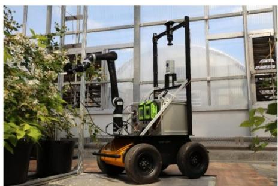

图2-1 移动平台方案一

方案二为地面履带移动平台，如图2-2所示[2]。履带与地面接触面积较大，单位接地比压较低，在松软或湿滑土壤上的附着力通常优于轮式结构，低速匀速性能较好，对小沟坎和垄面起伏也具有更强通过性。对于授粉这类低速精细作业，履带平台有助于降低站位过程中的瞬态冲击。其不足在于滚动阻力和转向阻力偏大，能耗一般高于四轮方案；履带机

构由履带板、导向轮、张紧机构等组成，泥水环境下维护频次较高，长期磨损会影响直行精度与重复定位表现。

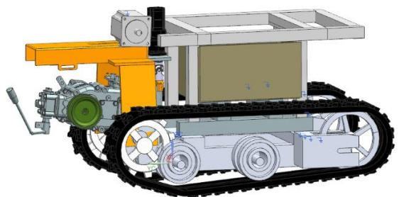

图2-2 移动平台方案二

方案三为运行于空中轨道的移动平台[3]，如图 2-3 所示。该方案将行走机构转移至棚架上方，移动轨迹由轨道几何直接约束，能够显著降低地面条件波动对位姿稳定性的影响。平台本体不再压过垄面与根域，可减少地面行走对作物和土壤环境的扰动。从系统协同看，空轨平台更利于相机与机械臂执行重复对位，适合识别、定位与授粉的周期化作业节拍；供电线缆、气路和供液管路也可沿轨道统一布设。该方案的主要不足是前期需建设轨道及支撑结构，对安装精度和棚体承载能力有要求，跨区改线灵活性受轨道布局限制。

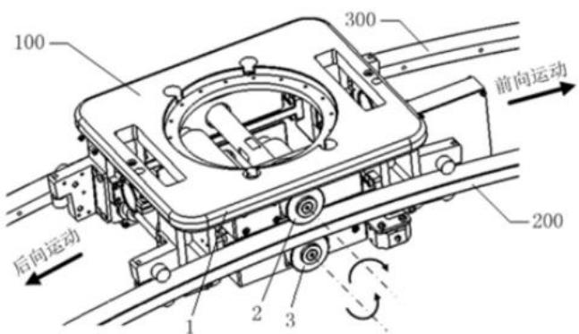

图2-3 移动平台方案三

从运行组织角度看，空轨平台可将定位基准与棚体固定构件统一，便于把作业区域划分为等间距站位点。平台每次停靠后，倒吊机械臂在单侧瓜田范围内展开局部作业，可减少往复调整并缩短单花处理节拍。对于多日重复授粉任务，轨道基准稳定性有利于保留历史坐标，实现同株花位复访和缺漏补作。

从结构匹配角度看，空轨平台与倒吊机械臂之间的接口关系明确，安装基准可一次标定后长期复用。移动单元沿轨道运行时，机械臂基座姿态变化较小，能够降低因底盘姿态漂移引起的末端补偿量，这对温室内高频、连续授粉任务具有实际意义。

同时，轨道方案便于按照棚内立柱节距进行模块化布置，后续扩展作业长度时可通过增加轨道段实现。这种结构扩展方式与以固定大棚为对象的应用场景相一致。轨道采用分

段布置时，还能降低安装难度，并便于在非使用时期拆分收纳。

三种移动平台方案的对比结果如表 2-1 所示，综合温室西瓜授粉场景对稳定性、重复性和作物安全性的要求，移动平台最终选择方案三。尽管前期安装投入较高，但其在作业一致性、路径约束和后续控制集成方面更符合场景需求，有利于提高连续授粉作业的可靠性。

表2-1 移动平台方案比较

Table 2-1 Comparison of Mobile Platform Schemes

<table><tr><td>评价指标</td><td>方案一：地面四轮移动平台</td><td>方案二：地面履带移动平台</td><td>方案三：运行于空中轨道的移动平台</td></tr><tr><td>作业稳定性</td><td>中，受地面起伏影响</td><td>中高，低速行走较平稳</td><td>高，轨道约束下姿态稳定</td></tr><tr><td>作业精准程度</td><td>中，打滑会引入定位偏差</td><td>中，磨损后精度易波动</td><td>高，重复定位一致性好</td></tr><tr><td>部署与维护</td><td>部署简便，维护较容易</td><td>维护量较大，部件磨损明显</td><td>前期安装要求高，运行维护难度中等</td></tr></table>

# 2.2 末端执行器方案比较

末端执行器直接作用于花朵，是影响授粉效果与花器官安全性的核心部件。考虑温室作业中的连续性需求与花朵脆弱特性，本节比较夹持式蘸液授粉刷与电磁阀控气液两相雾化喷嘴两种方案。

方案一为夹持式蘸液授粉刷，如图 2-4 所示[4]。该方案通过机械夹持或导向机构将刷头送至花朵附近，并以接触方式完成授粉液或花粉转移。其优点是作用路径直观、单次作用量集中，在目标姿态较规则时具有较好的命中性。但接触式授粉对末端位姿和接触力控制要求较高，进给速度或接触角设置不当时，容易造成花瓣和柱头局部受力偏大；此外刷头在多花连续作业后易出现附着物累积，需要清理或更换，长期作业一致性受磨损影响明显。

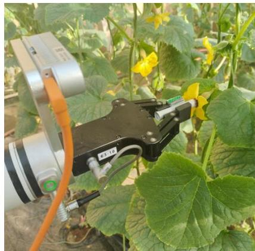

图2-4 授粉机构方案一

方案二为电磁阀控气液两相雾化喷嘴，如图2-5所示[5]。该方案由三通电磁阀3、末端雾化单元 4、授粉液储存装置、气泵与蠕动泵构成，利用电磁阀和泵速协同控制实现定量

批注 [昊孙8]: 图题表题以及表格中的内容，字号均为5号字，请统一修改

批注 [a9R8]: 已修改

喷施。其主要特点是非接触作业，可在保持安全间隙的条件下完成授粉，降低末端直接接触西瓜花从而使其受伤的概率。

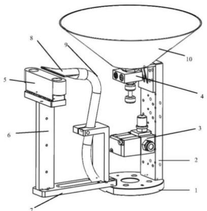

图 2-5 授粉机构方案二

在控制层面，喷射时长、间歇周期和供液流量可以参数化管理，便于形成一致的作业节拍；雾化锥角对小范围定位误差具有一定容忍度，适合连续巡检式授粉。需要注意的是，该方案对雾滴粒径、喷射距离和局部气流较敏感，参数设置不合理时可能出现漂移或附着不足，同时新增气液回路后系统集成复杂度有所上升。

在工程实现中，气液两相雾化方案可围绕喷嘴口径、供液流量和供气压力三参数进行联合标定，形成不同花期下的喷施参数表。针对温室局部风扰动，可通过缩短喷射距离并在喷嘴前端配置导流结构来减小雾滴扩散半径。与接触式机构相比，该方案将易损件集中在喷嘴和软管接口，替换流程标准化程度较高，更适合调试阶段的快速调参与维护。

在授粉质量控制方面，雾化方案还便于按花朵开花状态设置分级参数。例如在目标较密集区域可采用较短脉冲和较低流量，避免局部液量累积；在花位分散区域可适当提高喷射持续时间，以保证覆盖效果。该参数化能力使同一硬件平台能够适配不同作业工况。

此外，喷嘴末端尺寸相对紧凑，更容易在枝叶间保持安全间隙并完成姿态调整。当视觉定位结果存在小幅波动时，非接触喷施方式对末端微小偏差的容错能力也更适合作为末端执行器的首选方案。

与刷头方案相比，雾化方案在连续作业中的状态可观测性更好，喷射频率、流量和动作时序都可直接记录。这有利于后续对授粉质量进行过程追踪，也便于依据试验结果回调控制参数。

两种末端执行器方案的对比结果如表 2-2 所示，结合西瓜花授粉高频重复、低扰动接近和稳定剂量控制的需求，末端执行器最终选择方案二。通过非接触喷施和阀泵协同控制，该方案更有利于在保持花器官安全的前提下提高作业一致性，也便于后续与视觉测距和轨迹控制进行联动。

表2-2 末端执行器方案比较

Table 2-2 Comparison of End-Effector Schemes

西瓜花自动授粉机器人设计

<table><tr><td>评价指标</td><td>方案一：夹持式蘸液授粉刷</td><td>方案二：电磁阀控气液两相雾化喷嘴</td></tr><tr><td>授粉方式</td><td>接触式刷头蘸液</td><td>非接触气液雾化喷施</td></tr><tr><td>作业精准程度</td><td>中，受接触姿态和刷头状态影响</td><td>高，喷射时长与流量可调</td></tr><tr><td>对花器官影响</td><td>中高，接触控制不当易产生机械干扰</td><td>低，保持安全距离下可稳定作业</td></tr></table>

# 2.3 机械臂方案比较

机械臂承担授粉头在局部空间内的精确位姿调整，是连接移动平台与末端执行器的关键执行单元。其驱动方式影响控制精度与维护难度，构型参数决定可达空间和避障能力。因此需要分别从驱动与结构两个层面完成方案确定，并保证与前述平台和末端方案协调，满足系统总体要求。

# 2.3.1 机械臂驱动方式比较

方案一为液压驱动，如图2-6所示[6]。液压系统具有较高功率密度和输出力矩，适用于重载、抗冲击工况，在特定控制策略下可获得较平稳的运动表现。但对西瓜花授粉这样轻载高精度的任务而言，液压方案需要泵站、油路和密封系统，整机质量与体积增幅明显，不利于空轨平台倒吊安装；同时存在油液泄漏、温升管理和维护周期较长等问题。

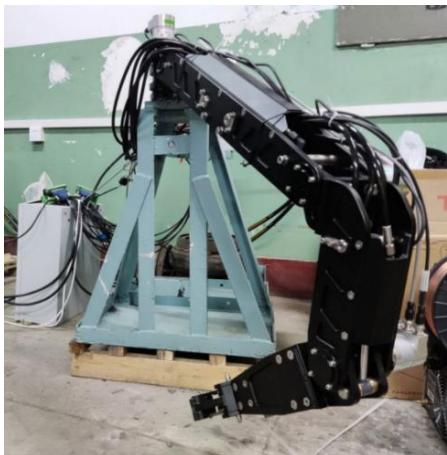

图2-6 机械臂驱动方案一

方案二为气压驱动，如图2-7所示[7]。气动执行元件质量较轻，介质清洁，具备一定柔顺性，能够在碰撞场景下起到缓冲作用。然而空气可压缩性会带来刚度不足与响应滞后，低速微动时易出现定位波动；当授粉任务要求末端在小尺度空间内稳定对准花朵时，其重复精度通常受供气波动影响较大。另需配置稳定气源及管路系统，噪声与维护工作不可忽略。

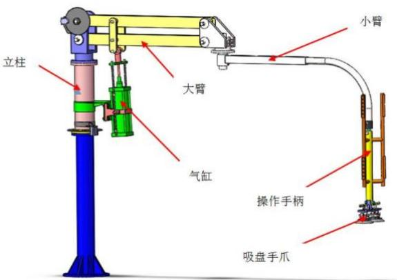

图2-7 机械臂驱动方案二

方案三为电机驱动，如图 2-8 所示[4]。伺服电机配合减速器与编码器可实现较高的位置分辨率和闭环控制精度，便于与视觉引导、路径规划和多轴协同控制算法集成。在倒吊安装条件下，电驱方案可通过关节分布式布置实现较好的质量分配，兼顾动态响应与结构紧凑性；其维护工作主要集中在线缆管理、散热和参数标定，工程实施路径较清晰。

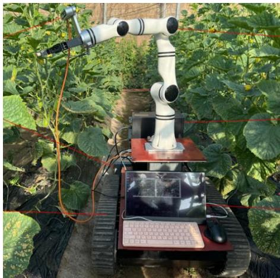

图2-8 机械臂驱动方案三

在运行调试与日常维护方面，电机驱动便于引入统一总线通信和状态监测机制，可实时采集关节电流、温度与编码器反馈，用于异常检测与维护预警。在机械臂调试的过程中，当末端抖动或对位误差出现时，可通过日志快速定位到具体关节和控制参数，调试效率通常高于需要逐项检查油压或气压回路的方案。

在稳定性方面，针对温室内长时间低速运行工况，电机驱动还可通过速度前馈、摩擦补偿和关节限速策略降低低速爬行现象，使末端靠近花朵过程更加平稳。该特性对喷施落点稳定性具有直接意义。此外，结合空轨平台的安装条件，电机驱动还可通过软件限位与加减速曲线管理关节冲击，从而减小倒吊结构在启停阶段的振动传递，对提升整机稳定性

具有积极作用。

三种机械臂驱动方式的对比结果如表 2-3 所示，综合比较后，机械臂驱动方式选择方案三。该方案在定位一致性、系统集成便利性与工程实现可行性方面更契合温室西瓜花授粉需求。

表2-3 机械臂驱动方式比较

Table 2-3 Comparison of Manipulator Drive Modes

<table><tr><td>评价指标</td><td>方案一：液压驱动</td><td>方案二：气压驱动</td><td>方案三：电机驱动</td></tr><tr><td>作业精准程度</td><td>中，重载能力强但精密控制链路复杂</td><td>中低，低速微动稳定性受供气波动影响</td><td>高，闭环控制下重复定位稳定</td></tr><tr><td>系统复杂度</td><td>高，油路与密封系统较复杂</td><td>中，需持续稳定气源</td><td>中，电控链路清晰且模块化程度高</td></tr><tr><td>维护适配性</td><td>中低，维护周期和成本较高</td><td>中，管路与气源维护较频繁</td><td>高，温室场景下维护与调试较方便</td></tr></table>

# 2.3.2 机械臂构型方案

机械臂构型需满足既定温室空间约束。已知大棚总宽度为 $6 \textrm { m }$ ，瓜田分为左右两列，每列宽 $1 . 7 \mathrm { m }$ ；系统采用空轨移动平台搭载倒吊机械臂，机械臂基座距地面瓜田高度为0.89m。结合作业流程，平台沿轨道完成纵向移动后，机械臂单次驻停应在横向至少覆盖 $1 . 7 \mathrm { m }$ ，以满足单侧瓜田作业范围；竖向则需保证授粉头能够下探至花朵分布区并具备一定避障调姿余量。

在自由度确定方面，若仅考虑末端到达目标点，3 个自由度即可描述空间位置；但授粉作业还要求喷嘴相对花朵保持合适入射方向，并在叶片遮挡下进行姿态重构。低于6自由度的构型在复杂植株环境中易出现可达但不可操作的情况，即末端可到位但喷射方向或避障姿态无法满足要求。倒吊安装还会放大部分位形下的奇异敏感性，因此需要在腕部配置独立姿态调节能力。

基于上述分析，机械臂采用六自由度关节型构型：关节1完成方位回转，关节2和关节3负责主要伸展与下探，关节4~关节6构成腕部姿态调整单元，用于喷嘴方向精调与局部避障。该构型有利于位姿解耦控制，便于与视觉坐标标定、逆运动学求解及轨迹规划相结合。按照标准 D-H 方法建立连杆坐标系，取 $z _ { i }$ 轴与第 i 关节轴重合， $x _ { i }$ 轴由相邻 z 轴公法线方向确定。表 2-4 按关节 1~6 逐行给出连杆参数，并列出各关节设计转角范围，如表2-4 所示。

表2-4 六自由度倒吊机械臂D-H参数表

Table 2-4 D-H Parameters of the 6-DOF Inverted Manipulator

<table><tr><td>关节</td><td>ai-1/mm</td><td>ai-1/(°)</td><td>di/mm</td><td>θi/(°)</td></tr><tr><td>1</td><td>0</td><td>-90</td><td>120</td><td>θ1∈[-160, 160]</td></tr><tr><td>2</td><td>720</td><td>0</td><td>0</td><td>θ2∈[-100, 120]</td></tr><tr><td>3</td><td>680</td><td>0</td><td>0</td><td>θ3∈[-135, 135]</td></tr><tr><td>4</td><td>0</td><td>-90</td><td>210</td><td>θ4∈[-180, 180]</td></tr></table>

续表2-4 六自由度倒吊机械臂D-H参数表

续表

批注 [昊孙10]: 若表格无可避免出现了分段，请按照此格式进行修改

批注 [a11R10]: 收到。在所有内容完成后进行总体排版时将统一解决此问题。

江南大学学士学位论文

<table><tr><td>关节</td><td>ai-1/mm</td><td>ai-1/(°)</td><td>di/mm</td><td>θi/(°)</td></tr><tr><td>5</td><td>350</td><td>90</td><td>0</td><td>θ5∈[-120, 120]</td></tr><tr><td>6</td><td>0</td><td>0</td><td>120</td><td>θ6∈[-180, 180]</td></tr></table>

# 本章小结

本章围绕西瓜花自动授粉系统的关键机械方案完成了分层比较与参数化确定。首先，在移动平台方面，针对地面四轮、地面履带与空中轨道三类方案，从地面适应性、定位重复性和维护特性进行分析。考虑温室灌溉环境带来的地面不确定性，以及授粉作业对稳定驻停和重复路径的依赖，最终确定采用空中轨道移动平台。其次，在末端执行器方面，对夹持式蘸液授粉刷与电磁阀控气液两相雾化喷嘴进行比较，结果表明非接触喷施方式更适合西瓜花器官较脆弱、作业批量较大的工况，因此确定采用气液两相雾化喷嘴方案。再次，在机械臂驱动方式方面，液压与气压方案分别在负载能力或柔顺性上具有特点，但在轻载高精度授粉任务中存在体积、维护或定位一致性方面的限制；电机驱动在多轴协同、控制精度和系统集成上更适合大棚内西瓜花授粉的场景，故确定为最终驱动方式。最后，依据大棚宽度、瓜田分列宽度、倒吊安装高度与单侧覆盖要求，完成机械臂工作空间分析并确定六自由度关节构型，给出了后续运动学建模与控制设计所需的D-H参数。由此，本章形成空轨移动平台 $^ +$ 电机驱动六自由度机械臂 $+ \prime$ 气液两相雾化末端的总体技术路线，为后续的具体结构设计提供了直接依据。

# 第 3 章 自动授粉系统各组成部分的结构设计

本章围绕大棚内西瓜花自动授粉系统的主要机械部件展开结构设计。对授粉系统的各组成部分的设计进行了说明，并进行了相关的计算校核。轨道部分需要解决倒吊工况下的承载与刚度问题，移动平台部分需要保证在双列空轨上的稳定牵引与驻停，机械臂部分需要满足花朵分布高度和单列瓜田半幅覆盖范围，末端执行器部分则需要兼顾喷嘴喷幅、供液节拍、供气压力与泵阀匹配关系。通过这些结构设计与计算校核，验证了本系统在大棚西瓜花授粉场景中的机械实现具有明确的工程可行性。

批注 [a12]: 篇幅过长，一段搞定

批注 [a13R12]: 已缩短

# 3.1 西瓜大棚建模

本设计面向典型温室大棚种植场景。经过广泛调研，实际生产中用于西瓜种植的温室大棚普遍长度在50米以上，脊高在3米左右，跨度在6米以上。考虑到本设计主要服务于自动授粉系统的结构设计、运动分析与仿真验证，在满足左右两列瓜田布置、管理通道预留、空轨安装及机械臂作业空间等基本要求的前提下，对大棚几何尺度进行了简化与适度缩小。因此，本设计中大棚长度约 $1 2 ~ \mathrm { m }$ ，高度约 $4 \mathrm { m }$ ，跨度取 $6 \mathrm { m }$ ，内部沿宽度方向分为左右两列瓜田，每列瓜田宽度 $1 . 7 \mathrm { m }$ ，中间设置管理通道。上述尺寸直接决定了空轨的横向安装位置、机械臂单侧覆盖半径以及整机沿棚向的运动范围。

如图 3-1 所示，大棚内的作业对象沿左右两列对称布置，自动授粉系统沿棚体上部环绕运行，无需进入垄沟内部行走。与地面行走机构相比，上部布置方式可避开灌溉环境和植株遮挡，并为供气、供液和电缆布线提供稳定安装空间。

从安装高度看，空轨下表面距瓜田约 $1 . 0 6 \mathrm { m }$ ，机械臂基座中心距地面约 $0 . 8 9 \mathrm { m }$ 。该高度关系使末端喷头能够从植株上方接近目标花朵，在保证作业空间的同时减小对藤蔓和叶片的干涉，因此授粉系统各结构尺寸均以该大棚尺度作为统一边界条件。

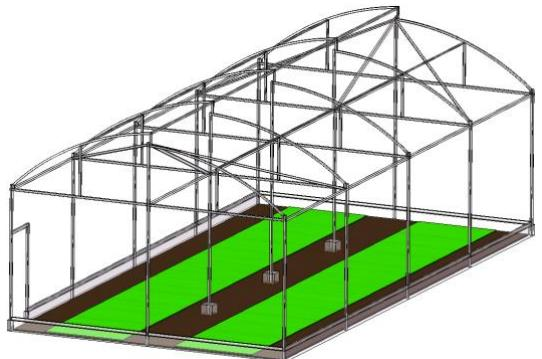

图 3-1 西瓜大棚示意图

批注 [a14]: 图题、表题以及表格内容都是五号字

# 3.2 轨道设计

批注 [a15R14]: 已修改

# 3.2.1 轨道设计

轨道系统采用环绕大棚布置的双列并行空轨结构，如图 3-2 和图 3-3 所示。两列轨道的中心线与单列 $1 . 7 ~ \mathrm { m }$ 宽瓜田的中部区域对应，保证倒吊式机械臂基座位于瓜田宽度方向

的合理位置。双轨内表面间距取 $1 5 0 \mathrm { m m }$ ，每列轨道截面采用 $5 0 \mathrm { m m } { \times } 1 0 0 \mathrm { m m }$ 、壁厚 $4 \mathrm { m m }$的竖向矩形管，材料选用 Q235B。

每段轨道两端由立柱支撑，单段跨度取 $3 . 5 \mathrm { m }$ ，共布置7段。为保证移动平台跨越立柱连接处时运行连续，轨道的上下表面及内侧表面均不设置阻挡，仅在双轨外侧与立柱连接。该结构便于上下摩擦轮夹持轨道表面形成牵引力，也便于导向轮对平台姿态进行约束。

Q235B矩形管具有加工方便、焊接性能稳定和承载能力适中的特点，能够满足棚内分段制造与安装要求。轨道采用双列并行形式后，平台自重及机械臂载荷可由两列轨道共同承担，机械臂外伸引起的滚转力矩也可由双轨形成的力偶抵消，因此该结构与倒吊作业工况相适应。

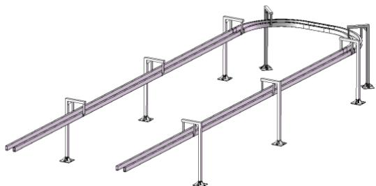

图3-2 轨道示意图

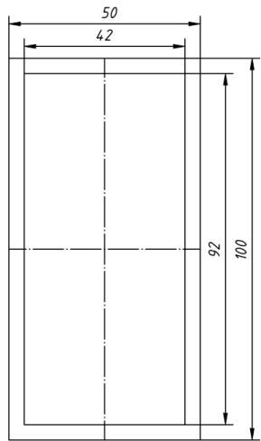

图3-3 轨道截面

# 3.2.2 轨道校核计算

轨道校核按单跨简支梁模型进行。整机载荷按移动平台与机械臂合计质量 $5 5 ~ \mathrm { k g }$ 进行估计，移动平台由上下驱动平台、基座、导向轮、控制器、半俯视相机、储液瓶、微型蠕动泵、微型气泵及连接附件组成，按 $1 5 ~ \mathrm { k g }$ 估计；而机械臂的质量可参考与本设计相接近的越疆 CR5 协作机器人，其整机质量为 $2 5 \mathrm { k g }$ ，考虑倒吊安装法兰、末端喷头、线缆拖链和局部加强件后，机械臂质量按 $4 0 ~ \mathrm { k g }$ 保守取值。考虑 1.2 的载荷系数后取设计载荷 650

N。矩形管轨道米重按 $8 . 9 6 \mathrm { k g / m }$ 取值，平台同时跨接两列轨道，基础工况下按竖向载荷均分进行计算。

$$
P = k _ {s} m g = 1. 2 \times 5 5 \times 9. 8 \approx 6 5 0 \mathrm {N} \tag {3-1}
$$

$$
q = 8. 9 6 \times 9. 8 = 8 7. 8 1 \mathrm {N} / \mathrm {m} \tag {3-2}
$$

式中， $P$ ——设计载荷，N；

$k _ { s }$ — 载荷系数；

$m$ 移动平台与机械臂合计质量，kg；

$g$ — 重力加速度， $\mathrm { m } / \mathrm { s } ^ { 2 }$ ；

$q$ ——轨道均布载荷， $\textnormal { N } / \textnormal { m }$

对 $5 0 \mathrm { m m } { \times } 1 0 0 \mathrm { m m } { \times } 4 \mathrm { m m }$ 矩形管，按竖向抗弯方向计算截面惯性矩和截面抵抗矩，结果如式 (3-3) 和式 (3-4) 所示。

$$
I = \frac {\left[ B H ^ {3} - (B - 2 t) (H - 2 t) ^ {3} \right]}{1 2} = 1. 4 4 \times 1 0 ^ {6} \mathrm {m m} ^ {4} \tag {3-3}
$$

$$
W = \frac {I}{(H / 2)} = 2. 8 8 \times 1 0 ^ {4} \mathrm {m m} ^ {3} \tag {3-4}
$$

式中， I ——轨道截面惯性矩， $\mathrm { m m } ^ { 4 }$ ;

$B$ ——轨道截面外宽， $\mathbf { m m }$

$H$ ——轨道截面外高，

t ——轨道壁厚，

$W$ ——轨道截面抵抗矩， $\mathrm { m m } ^ { 3 }$

基础竖向工况下，每列轨道承担一半设计载荷。单跨长度取 $3 . 5 \mathrm { m }$ ，则单列轨道跨中最大弯矩、最大弯曲应力和挠度分别如式 (3-5) 至式 (3-7) 所示。

$$
M = \frac {q L ^ {2}}{8} + \frac {(P / 2) L}{4} = 4. 1 9 \times 1 0 ^ {5} \mathrm {N} \cdot \mathrm {m m} \tag {3-5}
$$

$$
\sigma = \frac {M}{W} = 1 4. 5 3 \mathrm {M P a} \tag {3-6}
$$

$$
f = \frac {5 q L ^ {4}}{3 8 4 E I} + \frac {(P / 2) L ^ {3}}{4 8 E I} = 1. 5 6 \mathrm {m m} \tag {3-7}
$$

式中， M ——跨中最大弯矩， $\mathrm { N } \cdot \mathrm { m m }$

$L$ ——轨道单跨长度， $\mathrm { m m }$

$P$ — 设计载荷，

q ——轨道均布载荷， $\textnormal { N } / \mathrm { m m }$

$\sigma$ —轨道弯曲应力，MPa;

$W$ ——轨道截面抵抗矩， $\mathrm { m m } ^ { 3 }$ ；

$f$ ——轨道跨中挠度， $\mathbf { m m }$

批注 [a16]: 括号内是纯英文或数字的全用英文括号前后空两格

批注 [a17R16]: 已修改

$E$ —Q235B弹性模量，MPa；

I—轨道截面惯性矩， $\mathrm { m m } ^ { 4 }$ 。

Q235B弹性模量取 $2 . 0 6 \times 1 0 ^ { 5 }$ ，许用弯曲应力按 $1 4 0 \mathrm { M P a }$ 取值，挠度控制值按L/300取 $1 1 . 7 \ \mathrm { m m }$ 。由式 (3-6) 和式 (3-7) 可知，轨道在基础竖向工况下的强度和刚度均满足要求。

进一步考虑机械臂外伸产生的滚转偏载。机械臂对轨道的偏载扭矩按机械臂自重乘以力臂计算。机械臂自重按 $4 0 ~ \mathrm { k g }$ 估计，其重心力臂取基座水平偏置 $1 5 0 ~ \mathrm { m m }$ 与肩关节至末端工作点等效长度 $8 9 7 . 4 4 \mathrm { m m }$ 的一半之和，即 $5 9 8 . 7 2 \mathrm { m m }$ 。双轨内表面间距为 $1 5 0 \mathrm { m m }$ ，结合 $5 0 ~ \mathrm { m m }$ 轨道截面宽度可得两轨中心距约 $2 0 0 ~ \mathrm { { m m } }$ ，由双轨中心距 $2 0 0 ~ \mathrm { { m m } }$ 形成的力偶关系，可将偏载扭矩折算为受压侧轨道的附加集中载荷 $\mathrm { T } / 2 0 0 { \approx } 1 1 7 5 \mathrm { N }$ ；再与基础工况下单轨承担的集中载荷 $\mathrm { P } / 2 { = } 6 5 0 / 2 { = } 3 2 5 \mathrm { N }$ 叠加，可得 $\mathrm { P } _ { \mathrm { m a x } } { = } \mathrm { P } / 2 { + } \mathrm { T } / 2 0 0 { \approx } 1 5 0 0 \mathrm { N } .$ 。计算结果如式 (3-8) 至式 (3-11) 所示。

$$
T = G _ {a} l _ {a} = 4 0 \times 9. 8 \times 5 9 8. 7 2 = 2. 3 5 \times 1 0 ^ {5} \mathrm {N} \cdot \mathrm {m m} \tag {3-8}
$$

$$
M _ {\max } = \frac {q L ^ {2}}{8} + \frac {P _ {\max } L}{4} = 1. 4 5 \times 1 0 ^ {6} \mathrm {N} \cdot \mathrm {m m} \tag {3-9}
$$

$$
\sigma_ {\max } = \frac {M _ {\max }}{W} = 5 0. 2 0 \mathrm {M P a} \tag {3-10}
$$

$$
f _ {\max } = \frac {5 q L ^ {4}}{3 8 4 E I} + \frac {P _ {\max } L ^ {3}}{4 8 E I} = 5. 1 0 \mathrm {m m} \tag {3-11}
$$

式中， $T$ ——机械臂对轨道的偏载扭矩， $\mathrm { N } \cdot \mathrm { m m }$ ；

$G _ { a }$ Ga -机械臂自重，N；

$l _ { a }$ -机械臂重心到轨道中心的力臂，mm；

Mmax $M _ { \mathrm { m a x } }$ -最不利工况下轨道最大弯矩， $\mathrm { N } \cdot \mathrm { m m }$

$P _ { \mathrm { m a x } }$ Pma 最不利集中载荷，N；

$\sigma _ { \mathrm { m a x } }$ Omax 最不利工况下轨道最大弯曲应力， $\mathbf { M P a }$ ；

$f _ { \mathrm { m a x } }$ -最不利工况下轨道最大挠度，mm。

由式 (3-10) 和式 (3-11) 可知，在考虑机械臂偏载扭矩后的最不利工况下，轨道最大弯曲应力仍低于Q235B的许用弯曲应力，跨中挠度也小于控制值 $1 1 . 7 \mathrm { m m }$ ，因此所选双列矩形管空轨能够满足本系统的承载要求。

# 3.3 移动平台结构设计

# 3.3.1 移动平台结构设计

移动平台承担系统沿双列空轨的全局移动任务，其结构设计既要满足倒吊式安装条件，又要兼顾牵引、防滑、导向和载荷集成要求。按结构功能划分，平台主要由上驱动平台、下驱动平台、可调预紧连接机构和移动平台基座组成，其中上下驱动单元分别与轨道上、下表面接触，基座用于连接驱动单元并承载控制、视觉与供液供气相关部件。

上驱动平台结构如图 3-4 所示，其位于双列轨道上方，是移动平台主动夹持与传动链的上部执行单元。

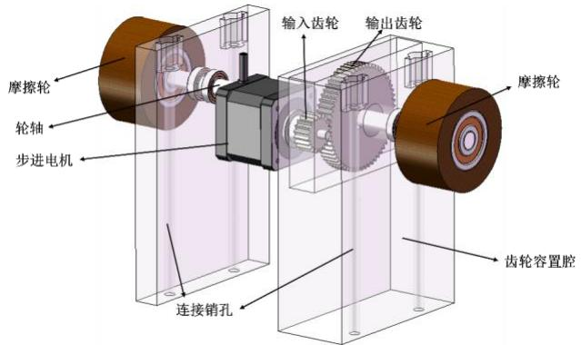

图3-4 上驱动平台

该部件主要由42步进电机、输入轴、齿轮副、轮轴和两只摩擦轮组成。动力由电机输出后，经输入齿轮与输出齿轮传递到直径 $6 0 \mathrm { m m }$ 、宽度 $3 0 \mathrm { m m }$ 的摩擦轮，再通过摩擦接触驱动平台沿轨道运动。平台两侧设置齿轮容置腔，用于支撑轮轴与电机，并为连接销和后续装配调整预留空间。

与之配合的下驱动平台如图 3-5 所示。下驱动平台位于双列轨道下方，为了使倒吊运行时的质量分布更加均衡，下驱动平台将电机布置在与上驱动平台相反的一侧。

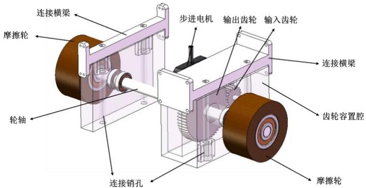

图3-5 下驱动平台

下驱动平台的传动路线与上驱动平台一致，同样由 42 步进电机通过齿轮副驱动两只摩擦轮。平台前进时，下驱动平台摩擦轮的转向与上驱动平台相反，从而在轨道上下表面形成同向牵引力，使平台能够稳定实现前进或后退运动。

上、下驱动平台的整体装配关系如图 3-6 所示。两者通过连接销、连接横梁和定位紧固件组合成夹持式驱动总成。

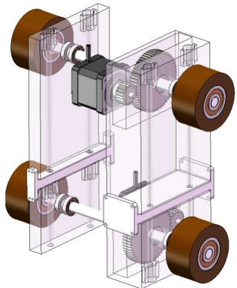

图3-6 上下驱动平台装配示意图

在图 3-6 所示装配结构中，上下驱动平台各自的连接销孔端部设置有弹簧，构成可调预紧机构。旋拧定位螺杆与螺母后，可调节上下摩擦轮之间的预留间隙及其对轨道的压紧量，使摩擦轮获得稳定的法向载荷；弹簧则用于补偿轨道制造误差和装配误差，避免局部间隙变化导致打滑或夹持过紧。

移动平台基座是整个平台的承载与功能集成中心，结构如图 3-7 所示。基座通过连接横梁与上下驱动平台固定成整体，基座的表面设置有导向轮支架，导向轮支架上的导向轮分别对轨道的上、下表面及左右内侧表面进行竖直方向的夹持与水平方向的支撑约束，从而限制平台除沿轨道方向运动之外的其余五个自由度。与此同时，基座上集中布置控制器、半俯视相机、储液瓶、微型蠕动泵和微型气泵，便于缩短供液供气管路并降低机械臂腕部负载。

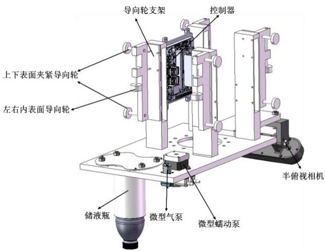

图3-7 移动平台基座

移动平台的总体装配形态如图 3-8 所示。图中可以看出，驱动、导向、控制与供液供气单元均围绕基座集中布置，下表面同时作为倒吊式机械臂的连接安装界面。该结构既便于整机装配与维护，也有利于在满足承载要求的前提下控制平台尺寸和重心位置。

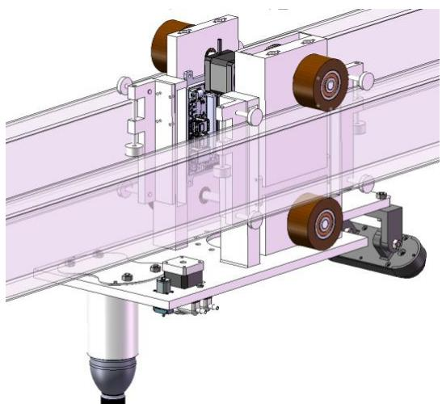

图3-8 移动平台总体示意图

# 3.3.2 移动平台参数计算

移动平台参数计算包括驱动力需求、传动比确定、运行速度核算和驻停锁紧能力分析。平台总运动质量按 $5 5 ~ \mathrm { k g }$ 取值，42 步进电机保持转矩取 $0 . 4 0 ~ \mathrm { N \cdot m }$ ，摩擦轮半径取 $3 0 ~ \mathrm { m m }$ ，齿轮传动效率按0.90计。

平台沿水平轨道低速运行时，阻力主要由导向轮滚动阻力、摩擦轮变形损失和启停惯性组成。取等效滚动阻力系数0.05，牵引力的裕量系数为1.3，启停加速度 $0 . 1 5 \mathrm { m } / s ^ { 2 }$ ，则滚动阻力与驱动总牵引力如式 (3-12) 和式 (3-13) 所示。

$$
F _ {r} = \mu_ {r} m g = 0. 0 5 \times 5 5 \times 9. 8 = 2 6. 9 5 \mathrm {N} \tag {3-12}
$$

$$
F _ {d} = 1. 3 \left(F _ {r} + m a\right) = 1. 3 \times (2 6. 9 5 + 5 5 \times 0. 1 5) = 4 5. 7 6 \mathrm {N} \tag {3-13}
$$

式中， $F _ { r }$ ——平台滚动阻力，

$\mu _ { r }$ 等效滚动阻力系数；

$m$ ——平台总运动质量，

$F _ { d }$ 平台驱动总牵引力，

a——启停加速度， $\mathrm { m } / \mathrm { s } ^ { 2 }$

系统由上下两个驱动平台共同提供牵引，单台电机所需输出转矩及最小传动比如式(3-14) 和式 (3-15) 所示。

$$
T _ {\mathrm {r e q}} = \frac {F _ {d} r}{2} = \frac {4 5 . 7 6 \times 0 . 0 3}{2} = 0. 6 8 6 \mathrm {N} \cdot \mathrm {m} \tag {3-14}
$$

$$
i _ {\min } = \frac {T _ {\text {r e q}}}{\eta T _ {m}} = \frac {0 . 6 8 6}{0 . 9 0 \times 0 . 3 0} = 2. 5 4 \tag {3-15}
$$

式中， Treq $T _ { \mathrm { r e q } }$ -单台电机所需输出转矩， $\Nu \cdot \mathrm { m }$

$r$ m ；

$i _ { \mathrm { m i n } }$ imir -最小传动比；

$\eta$ —齿轮传动效率;

$T _ { m }$ -步进电机有效工作转矩， $\mathrm { N } \cdot \mathrm { m }$

因此齿轮传动比取3较为合适，对应齿轮节径比可取 $2 0 \mathrm { m m } { : } 6 0 \mathrm { m m }$ 。若电机转速控制在 $1 0 0 ~ \mathrm { r / m i n }$ ，则平台线速度与理论单步位移分别如式 (3-16) 和式 (3-17) 所示。

$$
v = \frac {\pi D n _ {m}}{6 0 i} = \frac {\pi \times 0 . 0 6 \times 1 0 0}{6 0 \times 3} = 0. 1 0 5 \mathrm {m} / \mathrm {s} \tag {3-16}
$$

$$
s = \frac {\pi D}{N i} = \frac {\pi \times 6 0}{2 0 0 \times 3} = 0. 3 1 4 \mathrm {m m / s t e p} \tag {3-17}
$$

式中，ν平台线速度， $\textrm { m } / \textrm { s }$ ；

$D$ ——摩擦轮直径， $\mathrm { m m }$

$n _ { { } _ { m } }$ n -电机转速， $\mathrm { { r } / \mathrm { { m i n } } }$

i- 传动比；

$s$ mm / step ；

$N$ —电机每转整步数；对 $1 . 8 ^ { \circ }$ 电机， $\Nu = 2 0 0 _ { \circ }$

当驱动器采用16细分时，理论指令分辨率约为 $0 . 0 2 0 \mathrm { m m }$ /细分步，可满足棚内低速移动与驻停定位要求。

平台驻停授粉时还需抵抗机械臂动作及轨道局部安装误差带来的沿轨道方向扰动力。按轨道局部坡度 $1 ^ { \circ }$ 、机械臂等效质量 $4 0 \mathrm { k g }$ 、沿轨道方向扰动加速度 $0 . 3 \mathrm { m } / s ^ { 2 }$ 进行估算，则扰动力与理论锁紧切向力如式 (3-18) 和式 (3-19) 所示。

$$
F _ {j} = m g \sin \alpha + m _ {a} a _ {a} = 5 5 \times 9. 8 \sin 1 ^ {\circ} + 4 0 \times 0. 3 = 2 1. 4 \mathrm {N} \tag {3-18}
$$

$$
F _ {h} = \frac {2 \eta i T _ {h}}{r} = \frac {2 \times 0 . 9 0 \times 3 \times 0 . 4 0}{0 . 0 3} = 7 2 \mathrm {N} \tag {3-19}
$$

式中， $F _ { j }$ 沿轨道方向扰动力，N;

$\alpha$ -轨道局部坡度，°;

$m _ { a }$ m 机械臂等效质量，kg;

$a _ { \scriptscriptstyle a }$ a -沿轨道方向扰动加速度， $\mathrm { m } / \mathrm { s } ^ { 2 }$ ;

$F _ { h }$ -理论锁紧切向力，N；

$T _ { h }$ 电机保持转矩， $\Nu \cdot \mathrm { m }$

由式 (3-18) 和式 (3-19) 可知，两台电机合成的理论锁紧切向力大于驻停时可能出现的沿轨道方向扰动力；结合摩擦极限与弹簧预紧要求，平台在正常带电工况下具备运行与驻停的基本稳定性。

除电机输出能力外，摩擦轮传动还应满足防滑条件。保守取包胶摩擦轮与钢轨之间的摩擦系数为0.35，并取1.5的防滑安全系数，则总正压力至少应达到 $1 9 6 \mathrm { N } .$ 。平台共有4个驱动摩擦轮，因此单轮预紧力设计下限约为 $5 0 \mathrm { N }$ ，弹簧调节机构应保证不低于该值，以保证运行与驻停阶段均不发生打滑。为给轨道制造误差、安装偏差和长期磨损预留调节余量，工程设计中可在上述基础上进一步提高名义预紧力。若按总正压力 $2 4 0 \mathrm { N }$ 进行设计，则折算到单轮的名义预紧力约为 $6 0 ~ \mathrm { N }$ 。对于线性压缩弹簧，若安装预压缩量取 $5 \mathrm { \ m m }$ ，则所需弹簧刚度约为 $1 2 \ \mathrm { N / m m }$ 。当通过定位螺杆将压缩量调节在 $4 { \sim } 6 ~ \mathrm { m m }$ 范围内时，单轮预紧力约为 $4 8 { \sim } 7 2 \mathrm { N }$ ，可兼顾防滑要求与弹性补偿能力。

# 3.4 机械臂设计

# 3.4.1 机械臂结构设计

机械臂采用倒吊式安装方式，基座通过法兰固定在移动平台下表面，其总体结构如图3-9所示。该布置方式能够充分利用棚顶空间，使机械臂由上向下进入植株区域，减少地面机构对通道的占用，并便于末端喷头从花朵上方建立稳定工作位姿。

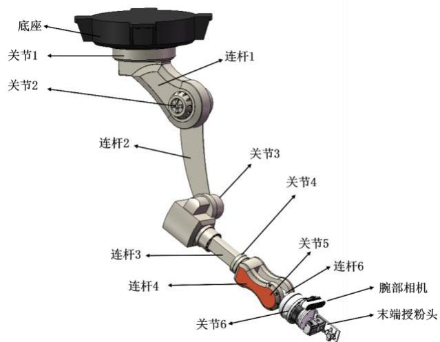

图3-9 机械臂示意图

如图3-10所示，机械臂基座中心到肩关节中心的竖向偏置为 $1 6 0 \mathrm { m m }$ 、水平偏置为150mm，肩关节到肘关节中心距离为 $3 0 0 ~ \mathrm { m m }$ ，肘关节到腕部关节中心距离为 $2 3 0 . 4 4 \ \mathrm { m m }$ ，腕部关节中心到末端工作点的等效长度为 $3 6 7 ~ \mathrm { m m }$ 。关节 2 和关节 3 承担主要伸展与下探功能，腕部关节负责姿态调整。

由于末端执行器采用非接触喷施方式，机械臂的作业目标并非与花心发生刚性接触，而是在稳定工作距离内完成局部定向喷施。因此，机械臂结构设计更强调作业空间、姿态调整能力和倒吊安装条件下的整体紧凑性。

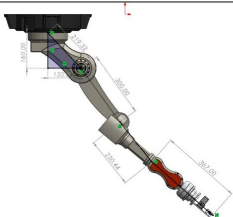

图3-10 机械臂各连杆长度

# 3.4.2 机械臂作业范围核算

机械臂作业范围核算需要结合实际授粉工况进行。待授粉西瓜花花心距地面高度约$1 0 0 \mathrm { m m }$ ，喷头与目标花心之间的工作距离取 $5 0 \mathrm { m m }$ 。需要说明的是，该工作距离沿喷嘴轴线定义，不能直接作为竖向高度增量；为建立统一几何关系，记喷嘴轴线与竖直方向夹角为γ，则其竖向分量和水平方向分量分别参与垂向与横向覆盖计算。

首先核算垂直方向的可达性。机械臂基座中心高度、肩关节下偏置和肩关节到末端工作点的等效长度均按已定结构尺寸取值，喷嘴出口点高度由花心高度与工作距离的竖向投影共同确定，计算关系如式 (3-20) 至式 (3-22) 所示。

$$
H _ {s} = H _ {b} - h _ {0} = 8 9 0 - 1 6 0 = 7 3 0 \mathrm {m m} \tag {3-20}
$$

$$
H _ {n} = h _ {f} + l _ {w} \cos \gamma = (1 0 0 + 5 0 \cos \gamma) \mathrm {m m} \tag {3-21}
$$

$$
\Delta H = L _ {e} - \left(H _ {s} - H _ {n}\right) = (2 6 7. 4 4 + 5 0 \cos \gamma) \mathrm {m m} \tag {3-22}
$$

式中， $H _ { s }$ ——肩关节中心高度，mm;

$H _ { b }$ ——机械臂基座中心高度，mm;

$h _ { 0 }$ ——肩关节相对基座的竖向偏置，mm；

$H _ { n }$ H 喷嘴出口点高度，mm;

$h _ { f }$ -花心距地面高度，mm；

$l _ { \scriptscriptstyle w }$ -喷头与花心的工作距离，mm；

Y—喷嘴轴线与竖直方向夹角；

$\Delta H$ —机械臂垂向裕量，mm；

$L _ { e }$ ——肩关节到末端工作点的等效长度，mm。

由式 (3-22) 可知，机械臂的垂向裕量随喷头姿态变化而变化，但在满足外缘授粉要求的姿态范围内仍保留足够余量，可用于避让叶片、修正喷头方向并吸收装配误差。

再核算单侧横向覆盖范围。喷嘴出口点相对于基座回转中心的水平半径由机构几何尺

寸决定，而目标花心的有效覆盖半径应在此基础上叠加工作距离的水平方向投影，而不是采用喷幅进行替代。对应计算关系如式 (3-23) 至式 (3-25) 所示。

$$
\begin{array}{l} R _ {n} = e + \sqrt {L _ {e} ^ {2} - \left(H _ {s} - H _ {n}\right) ^ {2}} (3-23) \\ = (1 5 0 + \sqrt {8 9 7 . 4 4 ^ {2} - \left(7 3 0 - (1 0 0 + 5 0 \cos \gamma)\right) ^ {2}}) (\mathrm {m m}) (3-23) \\ \end{array}
$$

$$
R _ {e} = R _ {n} + l _ {w} \sin \gamma = (R _ {n} + 5 0 \sin \gamma) \mathrm {m m} \tag {3-24}
$$

$$
R _ {e} \geq 8 5 0 \mathrm {m m}, \text {可 得} 2 1. 2 ^ {\circ} \leq \gamma \leq 7 4. 8 ^ {\circ} \tag {3-25}
$$

式中， $R _ { n }$ ——喷嘴出口点相对于基座回转中心的最大单侧水平半径， $\mathrm { m m }$

$e$ 基座中心到肩关节的水平偏置， $\mathrm { m m }$

$R _ { e }$ ——目标花心的有效单侧覆盖半径， $\mathrm { m m }$

$l _ { w }$ — 喷头与花心的工作距离， $\mathrm { m m }$ ；

γ—喷嘴轴线与竖直方向夹角，。。

由式 (3-25) 可知，要覆盖单列瓜田半幅所需的 $8 5 0 \mathrm { m m }$ 范围，喷嘴轴线与竖直方向的夹角有解，在 $2 1 . 2 ^ { \circ }$ 至 $7 4 . 8 ^ { \circ }$ 之间。在该姿态范围内，喷头仍保持由上向下的授粉方向，因此倒吊式机械臂能够满足单列瓜田的横向授粉范围要求。

# 3.5 末端执行器设计

# 3.5.1 末端执行器设计

末端执行器负责在机械臂到达合理的授粉位置后进行授粉动作，其结构如图 3-11 所示。执行器由法兰连接板、喷头安装板、三通电磁阀、二流体喷嘴及软管接口组成。法兰转接板的一面与机械臂的末端连接,另一面设置垂直于法兰连接板平面的喷粉安装板,喷粉安装板的中间段设置有三通电磁阀,喷粉安装板的顶端设置有二流雾化喷嘴,三通电磁阀的第一端口连接外接供气气管,三通电磁阀通过第一气管与二流雾化喷嘴的第一接口连通,二流雾化喷嘴的第二接口外接花粉液的供液管。当需要执行授粉作业时,三通电磁阀通电,控制气体通过指定的时长，同时花粉液供液机构（包括储液瓶与微型蠕动泵）也推出相应量的花粉液,当花粉液和气体通过二流雾化喷嘴后形成雾化后的花粉液,均匀喷射到待授粉的西瓜花上完成授粉。

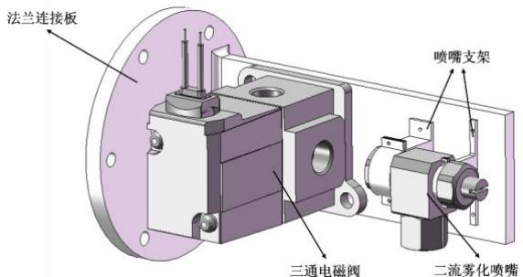

图3-11 末端执行器示意图

为减轻机械臂腕部负载，储液瓶、供液泵和供气装置均布置在移动平台基座上，具体

布置如图3-12所示。液路由 $2 5 0 \mathrm { m L }$ 储液瓶、MN1微型蠕动泵和软管组成；气路由SC8001PM微型正压泵、VT307-5G1-01-F三通电磁阀和软管组成。液体和压缩空气在喷嘴前端汇合后完成雾化喷施。

喷嘴型号选用CBIMV45005。该喷嘴属于紧凑型细雾扇形二流体喷嘴，具有结构尺寸小、低流量、适合局部定向喷施等特点；供液机构选用MN1蠕动泵的BT型号，即步进电机款，可连续调速，适合本设计的小剂量间歇供液工况。

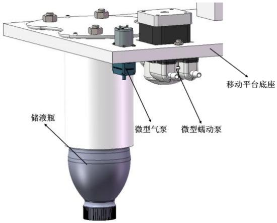

图3-12 供液装置示意图

# 3.5.2 末端执行器计算校核

首先进行喷嘴工作参数校核。根据CBIMV45005产品参数，在空气压力 $0 . 2 \mathrm { M P a }$ 、液体压力 $0 . 1 5 \mathrm { M P a }$ 的工况下，喷液流量为 $1 . 5 \mathrm { L } / \mathrm { h }$ ，空气消耗量为 $2 . 6 \mathrm { m l / m i n }$ ，特征喷雾宽幅约为 $1 1 0 \mathrm { m m }$ 。该参数说明喷嘴能够形成稳定的细雾扇面，但喷幅会随喷距而变化。

其次进行单次喷施量校核。按上述工作点，喷液流量折算为 $2 5 ~ \mathrm { m L / m i n }$ ；电磁阀单次开启时间取 $0 . 0 4 \ : \mathrm { s }$ ，则单次喷施量如式 (3-26) 所示。

$$
V _ {s} = \frac {q _ {l} t _ {s}}{6 0} = \frac {2 5 \times 0 . 0 4}{6 0} = 0. 0 1 6 7 \mathrm {m L} \tag {3-26}
$$

式中， $V _ { s }$ —单次喷施量，mL;

$q _ { l }$ —喷嘴喷液流量，mL/min；

$t _ { s }$ -单次喷施时间，s。

若按作业节拍 $2 \mathrm { s } /$ 朵估算，则平均液体需求和 $2 5 0 \mathrm { m L }$ 储液瓶可支持的理论喷施次数分别如式 (3-27) 和式 (3-28) 所示。

$$
Q _ {\text {a v g}} = \frac {6 0 V _ {s}}{t _ {c}} = \frac {6 0 \times 0 . 0 1 6 7}{2} = 0. 5 0 \mathrm {m L / m i n} \tag {3-27}
$$

$$
N _ {b} = \frac {2 5 0}{0 . 0 1 6 7} \approx 1. 5 0 \times 1 0 ^ {4} \text {次} \tag {3-28}
$$

式中， Qavg $Q _ { \mathrm { a v g } }$ 平均液体需求，mL/min；

$t _ { c }$ 单朵花授粉节拍，s ；

$N _ { b }$ —— $2 5 0 \mathrm { m L }$ 储液瓶可支持的理论喷施次数。

由式 (3-27) 和式 (3-28) 可知，平均液体需求为 $0 . 5 0 \mathrm { m L / m i n }$ 。该结果可用于确定储液容量与长期供液节拍，而喷嘴瞬时工作点仍以 $2 5 \mathrm { m L } / \mathrm { m i n }$ 、 $0 . 1 5 \mathrm { M P a }$ 为准。MN1微型蠕动泵的 BT 型号可较好地配合短时开启喷施，并通过调节泵速与电磁阀开启时间实现单次喷量标定。储液瓶容量也能够满足较长时间的连续作业要求。

最后进行供液与供气压力校核。CBIMV45005在所选工作点下的液体工作压力取0.15MPa，空气工作压力取 $0 . 2 0 \mathrm { M P a }$ 。MN1蠕动泵最大压力约 $0 . 1 7 \mathrm { M P a }$ ，SC8001PM 微型正压泵最大压力大于 $0 . 2 5 \mathrm { M P a }$ ，则液路与气路压力裕度分别如式 (3-29) 和式 (3-30) 所示。

$$
\zeta_ {l} = \frac {p _ {\mathrm {l , m a x}}}{p _ {\mathrm {l , r e q}}} = \frac {0 . 1 7}{0 . 1 5} = 1. 1 3 \tag {3-29}
$$

$$
\zeta_ {a} = \frac {p _ {\mathrm {a , s u p}}}{p _ {\mathrm {a , r e q}}} = \frac {0 . 2 5}{0 . 2 0} = 1. 2 5 \tag {3-30}
$$

式中， $\zeta _ { l }$ ——液路压力裕度；

l,max p — $p _ { \mathrm { l , m a x } }$ MN1 蠕动泵最大输出压力，

$p _ { \mathrm { { l , r e q } } }$ 喷嘴所需液体工作压力，MPa;

$\zeta _ { a }$ — 气路压力裕度；

a,sup p — $\boldsymbol { p } _ { \mathrm { a , s u p } }$ SC8001PM 供气压力，

a,req p — $p _ { \mathrm { { a , r e q } } }$ 喷嘴所需空气工作压力，

由式 (3-29) 和式 (3-30) 可知，SC8001PM 微型正压泵对 $0 . 2 0 \mathrm { M P a }$ 空气需求具有较明确裕度；MN1 蠕动泵在名义参数上能够覆盖 $0 . 1 5 ~ \mathrm { M P a }$ 液体工作点，但液路压力裕度仅为1.13，属于可用但偏紧的匹配关系。因此设计上应尽量缩短液路、减小局部阻力，若出现供液波动或雾化不足，应优先提高供液压力或更换更高压力泵型。

# 3.6 大棚内西瓜花自动授粉系统总体三维建模

利用三维建模软件 SolidWorks 对西瓜花自动授粉系统各部分进行建模并完成整个系统的装配。整个系统的结构与空间布局如图3-13所示，主要由大棚、空中轨道、移动平台、授粉装置与六自由度机械臂组成。

从正面与反面局部视图可以看出，供液装置、供气装置和控制部件均集中布置在移动平台基座附近，整机重心相对集中，有利于减小倒吊运行时的附加载荷和结构摆动。三维装配结果表明，各部件之间不存在明显空间干涉，整体布局满足大棚内授粉作业要求。

批注 [a18]: 所有公式已经改为mathtype格式，包括公式编号

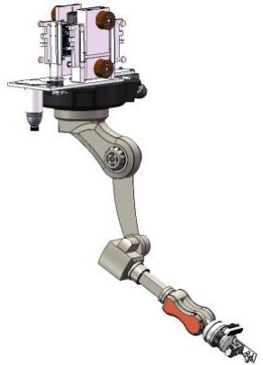

(a) 正面局部示意图

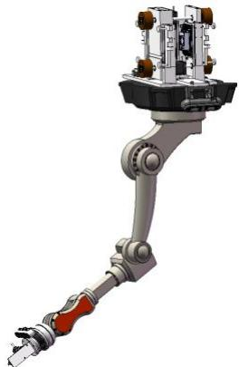

(b) 反面局部示意图

图3-13 授粉执行机构局部示意图

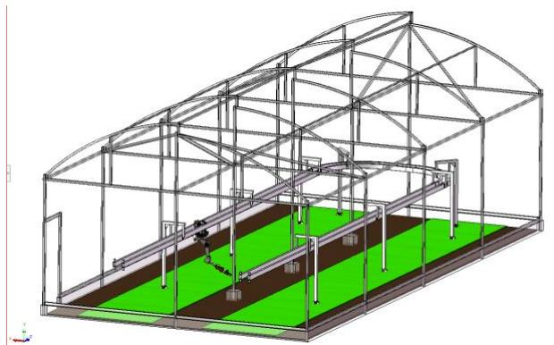

图3-14 大棚内西瓜花自动授粉系统总装图

批注 [a19]: 所有图片背景已经修改为纯白色

批注 [昊孙20]: 加一张总装图，大棚、轨道、机器人一起的

# 本章小结

本章完成了自动授粉系统各组成部分的结构设计与主要参数校核，把关键受力、驱动和空间关系落实到具体参数，使轨道跨距、平台质量、机械臂姿态范围及末端喷施工况之间的约束关系得到统一说明。结合 $6 \mathrm { m }$ 棚宽、约 $1 2 \mathrm { m }$ 棚长和左右两列 $1 . 7 \mathrm { m }$ 瓜田的布置条件，明确了双列空轨、移动平台和倒吊式机械臂的安装边界，并通过轨道强度与刚度计算验证了 $5 0 \ \mathrm { m m } { \times } 1 0 0 \ \mathrm { m m } { \times } 4 \ \mathrm { m m } \mathrm { Q } 2 3 5 \mathrm { B }$ 矩形管轨道满足承载要求。

在移动平台设计中，完成了上下夹持式驱动机构的结构说明及 42 步进电机驱动能力核算，并进一步给出了摩擦轮防滑所需的预紧力下限与带电驻停边界；在机械臂设计中，采用工作距离投影的方式重建了垂向与横向几何关系，并结合三维装配验证了单列瓜田横向区域覆盖的可实现性；在末端执行器设计中，采用二流体喷嘴、三通电磁阀、蠕动泵以及微型正压泵等液压元件实现对西瓜花授粉的功能，并依据各元件参数完成喷幅、单次喷施量、供液节拍以及供液供气压力的匹配校核。最后，通过总体三维装配验证了各部件之间不存在明显空间干涉，说明本章形成的设计方案能够满足大棚西瓜花自动授粉系统的实

现要求。

# 第 4 章 结构可行性仿真验证

# 4.1 自动授粉系统运动仿真

# 4.2 自动授粉系统有限元仿真（轨道抗弯 $+$ 静止时摩擦力是否足够）

# 4.2.1 轨道刚度与强度校核

# 4.2.2 移动平台静止时摩擦力校核

本章小结

# 第 5 章 控制系统设计与验证

# 5.1 自动授粉系统各器件选型与控制流程设计

为满足大棚西瓜花自动授粉作业对视觉识别、实时控制和精量喷施的要求，本系统采用上位机与下位机相结合的分层控制方案。上位机选用Jetson Orin Nano 边缘计算设备，配合移动平台上的 Intel RealSense D455 全局视觉传感器和机械臂腕部的 Intel RealSense D435局部视觉传感器，负责图像采集、YOLO目标检测、目标三维坐标获取以及机械臂逆运动学求解。下位机选用 STM32F407ZGT6，负责接收上位机下发的控制指令并输出各执行单元所需的实时控制信号。移动平台两台42步进电机采用TB6600 驱动器控制；末端授粉执行部分由 VT307-5G1-01-F 三通电磁阀、SC8001PM 微型正压泵、MN1 微型蠕动泵和CBIMV45005 二流体喷嘴组成。

如图 5-1 所示，系统启动后首先完成视觉与控制模块初始化，随后由全局相机采集作业区域图像并进行目标花朵检测。当未检测到目标时，移动平台沿轨道移动至下一作业位置继续搜索；当检测到目标后，机械臂先绕底座旋转至目标所在方向，再由腕部相机获取局部精确坐标，上位机完成位姿解算后将结果发送给下位机。STM32控制机械臂逐步靠近目标，当末端执行器到达设定工作位置后，启动微型正压泵和蠕动泵，并控制三通电磁阀导通，使花粉液与压缩空气在二流体喷嘴前端汇合雾化并喷向目标花朵。完成单次授粉后，系统判断局部区域及整棚作业是否结束，若未完成则继续执行下一目标的搜索与授粉流程。

江南大学学士学位论文

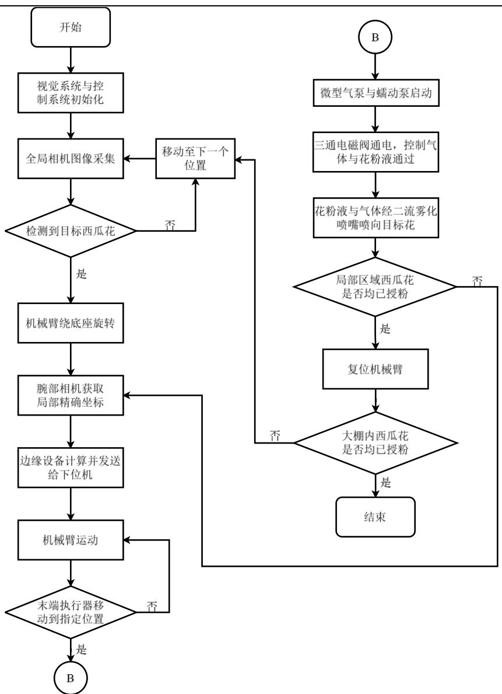

图5-1 授粉控制系统流程图

# 5.2 授粉系统电路设计

根据上述控制方案，设计授粉系统电路原理图，如图 5-2 所示。该电路主要由电源稳压模块、上位机视觉处理模块、STM32下位机控制模块、机械臂关节驱动模块、移动平台驱动模块以及末端执行器驱动模块组成。系统以24V直流电源作为主输入，其中一路经降压后为 Jetson Orin Nano 提供 19V 供电，另一路转换为 5V 和 3.3V，为 STM32F407ZGT6及相关逻辑控制电路供电；24V 母线同时为关节驱动器、步进驱动器和泵阀负载供电，从

而实现控制电源与执行电源的分级配置。

在接口连接上，D455 与 D435 均通过 USB3.1 接口接入 Jetson，上位机完成目标识别与坐标解算后，经串口将控制指令发送至 STM32。下位机再向机械臂六路关节驱动器输出脉冲、方向和使能信号，并向移动平台上下两侧 TB6600 输出对应控制信号，以实现机械臂与移动平台的协调运动。对于授粉执行部分，MN1微型蠕动泵采用独立步进驱动方式控制，以便实现供液节拍调节；VT307-5G1-01-F三通电磁阀和SC8001PM 微型正压泵则通过MOSFET 开关电路驱动，并并联续流二极管，以提高感性负载通断过程中的电路可靠性。该电路搭建了系统从视觉感知、指令传输到运动执行和末端喷施的控制链路，为后续系统的仿真实验与验证提供了硬件基础。

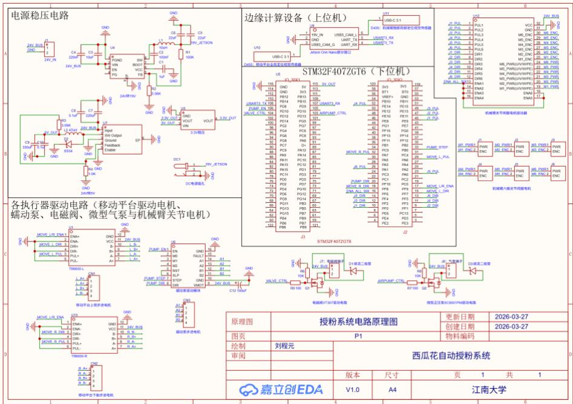

图5-2 授粉系统电路原理图

# 5.3 全局移动子系统电路仿真

为验证移动平台驱动电路及控制策略的可行性，在 Proteus 软件中建立了全局移动子系统仿真模型。考虑到 Proteus 元件库中缺少 STM32F407ZGT6 与 TB6600 的可执行仿真模型，仿真阶段采用同属 STM32F4 系列且控制资源满足需求的 STM32F401VE 作为下位机控制器，并以 $\mathtt { L 2 9 7 + L 2 9 8 }$ 组合对TB6600驱动部分进行等效替代，以验证“脉冲-方向-使能”控制链路和上下两台步进电机的协同运动规律。

按照5.2节给出的控制思路，仿真电路主要由单片机最小系统、左右两路L297步进控制器、两片L298双全桥驱动器、两台42步进电机以及相应的供电与保护电路组成，如图5-3 所示。STM32F401VE 输出的 PB2 作为公共使能信号，PB0 和 PB1 分别作为轨道上侧

电机与轨道下侧电机的方向控制信号，PA6 作为共享脉冲信号 STEP_CLK 同时接入两片L297的CLOCK端。采用公共时钟驱动的目的在于保证上下两台电机获得完全一致的脉冲频率和脉冲数，从而避免双路独立发脉冲时产生节拍偏差。结合移动平台上下摩擦轮的传动关系，平台前进时轨道上、下两侧摩擦轮需要反向旋转，因此程序中将两路方向信号设置为相反逻辑电平，以在轨道上下表面形成同向牵引力。

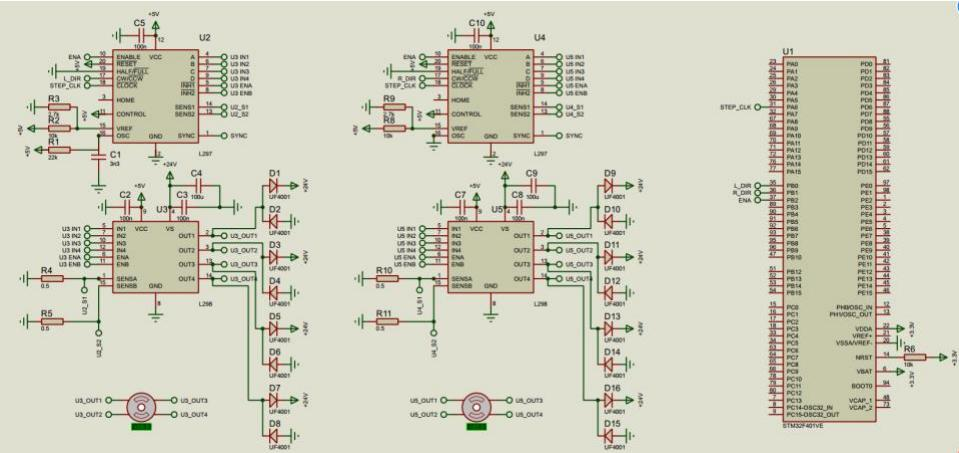

图5-3 全局移动子系统电路仿真原理图

在驱动级设计中，L297负责将单片机输出的STEP_CLK和方向信号转换为步进相序，L298 负责对两相绕组进行功率放大。仿真中为 L297 配置了振荡与基准电压网络，并在L298输出端加入续流二极管和电流采样电阻，以提高感性负载换相过程中的稳定性。控制程序在 STM32CubeIDE 中采用 C 语言编写，并编译生成 HEX 文件导入 Proteus 软件。程序按照“静止-匀加速-匀速-匀减速-静止”的单次运行流程输出脉冲序列。具体实现时，通过逐步提高共享时钟的脉冲频率实现匀加速段，在目标频率附近保持固定脉冲周期形成匀速段，再逐步降低频率完成匀减速段，最终停止输出脉冲。该控制方式能够较好地模拟移动平台从起步、稳定运行到停车的实际工作过程。

仿真结果如图5-4 所示，轨道上侧电机MOTOR_1与轨道下侧电机MOTOR_2 的转速显示分别呈正、负符号，说明两台电机转向相反；同时两者转速绝对值接近，表明共享时钟方式能够保证上下驱动电机近似等速运行。结合仿真过程可见，两台电机在起动阶段能够平稳加速，在匀速阶段保持连续稳定转动，在减速阶段逐步降至零速后停止，未出现明显的失步、抖动或相位紊乱现象。由此说明，所设计的下位机控制逻辑能够实现移动平台双电机的同步驱动与平滑启停，为整机全局移动控制提供了电路与程序层面的验证依据。

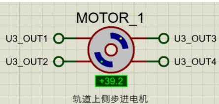

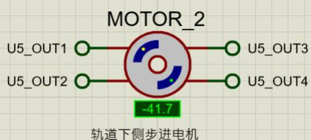

图5-4 移动平台上下两电机运行情况示意图

# 5.4 机械臂授粉子系统运动仿真

授粉控制系统可被分为全局移动子系统与机械臂授粉子系统，由于上节已经验证了全局移动子系统控制方案的可行性，因此，本节将在前文控制流程的基础上，使用ROS2与Moveit2在Rviz仿真环境下实现倒吊机械臂根据视觉传感器获取的目标坐标进行运动学解算并靠近的动作流程，从而对机械臂授粉子系统进行运动仿真验证，

考虑到三维模型与ROS系统的环境依赖，本节仿真实现使用了Windows 11与Linux(Ubuntu 24.04)两个操作系统，其中Windows系统负责将授粉系统的三维建模通过sw2urdf插件导出为URDF格式，Linux系统则负责后续工作：先导入通过SolidWorks输出的URDF与STL文件，再在ROS2 Jazzy中完成模型接入与关节方向校核，随后构建MoveIt2配置并在RViz中联调。机械臂通过world到base_link的静态变换实现倒吊安装，保证仿真姿态与实际安装方向一致。目标花心坐标由link_1锚点叠加参数偏移得到，授粉控制点选用pollination_tip_link，并按joint6轴向设置50mm工艺距离约束。如图5-6所示，在RViz中显示机械臂各关节坐标系与授粉坐标系后，可以直观看到末端方向与目标方向关系，从而验证坐标定义与偏置方向是否正确。

【图5-6 RViz中机械臂关节坐标系与授粉坐标系显示截图（待补充）】

在动作执行上，机械臂采用阶段式状态机完成“收缩初始位-基座顺时针预旋转90°-接近预授粉位-到达授粉位-停留-撤离-回收”的循环流程。该流程将轨迹规划与工艺顺序统一起来，可保证每次授粉前都先完成基座方向调整，再执行末端接近动作。如图5-7所示，单次循环的关键姿态切换清晰，动作连续。

为验证不同花位下的适应能力，本节设置六组典型目标工况：$dy\_world=0.85$时取$dx\_world=-0.20,0,0.20$，$dy\_world=-0.85$时取对称三组坐标。六组工况的俯视图与侧视图汇总如图5-8所示。由图5-8可见，机械臂在六组目标下均能完成“先旋转、后接近、再回收”的完整流程，并在授粉阶段保持稳定姿态，说明该仿真方案满足倒吊授粉任务的运动控制需求。

【图5-7 单次授粉循环关键帧截图（收缩位、预旋转位、预授粉位、授粉位）（待补充）】

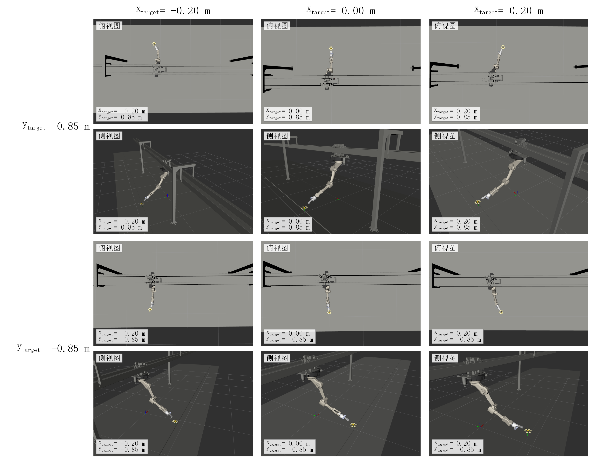

图5-8 机械臂授粉子系统运动仿真实验

# 本章小结

# 第 7 章 结论与展望

7.1 结论

7.2不足之处及未来展望

# 参考文献(从第二章开始)

[1] Ohi N, Lassak K, Watson R, et al. Design of an autonomous precision pollination robot[C]//2018 IEEE/RSJ international conference on intelligent robots and systems (IROS). IEEE, 2018: 7711-7718.

[2] 苏瑞娟.果园小型履带式电控底盘的设计与试验[D].山东农业大学,2023.DOI:10.27277/d.cnki.gsdnu.2023.000641.

[3] 中国科学院沈阳自动化研究所.一种摩擦轮驱动的空间移动平台:202110853759.4[P].2024-06-21.

[4] Zhao H, Xu S, Yan W, et al. Design and optimization of target detection and 3D localization models for intelligent muskmelon pollination robots[J]. Horticulturae, 2025,11(8): 905.

[5] 杭州乔戈里科技有限公司.授粉装置的末端执行机构:202421043622.8[P].2024-12-31.

[6] Xia Y, Nie Y, Chen Z, et al. Motion control of a hydraulic manipulator with adaptive nonlinear model compensation and comparative experiments[J]. Machines, 2022, 10(3): 214.

[7] 李鹏帅.气动助力机械臂结构设计与控制系统研究[D].天津大学,2016.

# 致谢
